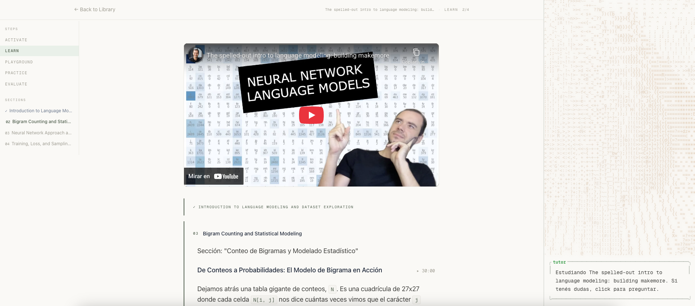
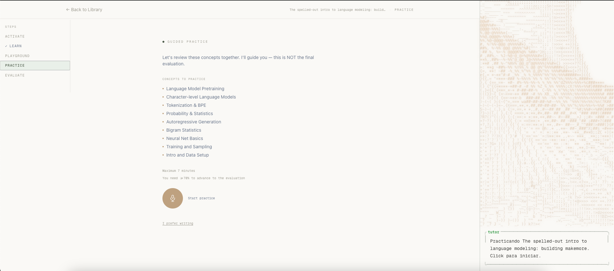

<div align="center">

# Jarre

**Turn any YouTube video into a full learning experience.**

[](https://www.gnu.org/licenses/agpl-3.0)


<!-- SCREENSHOT: Replace with a screenshot of the dashboard showing a generated course.
     Recommended size: 1200x720. Use a clean browser window, no bookmarks bar. -->


</div>

Paste a YouTube link, get a structured course with AI-generated content, evaluations, voice tutoring, and spaced repetition. Self-host it for free with your own API keys.

## Why Jarre

Most AI learning tools quiz you on surface-level recall. Jarre evaluates **depth of reasoning** — not whether you got the right answer, but whether you understand *why*.

It uses 10 specialized evaluation rubrics (not one generic prompt), each scoring 3 dimensions on a 0–6 scale. A rubric for comparing tradeoffs is fundamentally different from one that evaluates scenario diagnosis.

## Screenshots

| | |
|:---:|:---:|
|  |  |
| **Learn** — Guided reading with inline quizzes and video timestamps | **Practice** — Voice-guided review of concepts before evaluation |

## Features

**5-step learning flow:**

1. **Activate** — Pre-reading overview, concept map, exploratory voice chat
2. **Learn** — Guided reading with inline quizzes, clickable video timestamps, LaTeX rendering
3. **Apply** — Practical scenarios + interactive playgrounds (18 types)
4. **Practice** — AI-generated questions + voice practice sessions
5. **Evaluate** — 5 generated questions, automatic scoring, mastery determination

<details>
<summary><strong>Voice tutor — 7 session modes</strong></summary>

| Mode | What it does |
|------|-------------|
| eval | Oral exam disguised as conversation |
| practice | Guided practice with escalating hints |
| exploration | Connection-driven resource exploration |
| debate | Devil's advocate on technical topics |
| freeform | Open intellectual conversation |
| teach | You teach a confused junior (tests real understanding) |
| learning | Section-specific tutor while you read |

Real-time audio over WebSocket (Gemini). Supports interruptions, session resumption, live transcription, and tool calls (scroll to concept, show definition, end session).

</details>

<details>
<summary><strong>Evaluation — 10 specialized rubrics</strong></summary>

Each question type gets its own rubric with 3 dimensions scored 0–2 (total 0–6):

Knowledge, Comparison, Guarantee, Complexity, Scenario, Error Detection, Connection, Tradeoff, Design, Justification.

</details>

<details>
<summary><strong>Spaced repetition (FSRS)</strong></summary>

- 90% target retention, 180-day max interval
- Daily cap: 12 cards per session
- Interleaving: never two consecutive questions from the same concept

</details>

<details>
<summary><strong>More</strong></summary>

- Knowledge graph (force-directed 3D visualization)
- Mastery levels (0–4: Exposed, Familiar, Practiced, Proficient, Mastered)
- XP system and streaks
- Learner memory — tracks misconceptions per concept
- i18n (English / Spanish)
- Bring Your Own Key (BYOK) support

</details>

## How it works

Paste a YouTube URL into the dashboard. A 6-stage pipeline extracts the transcript, segments it into sections, generates pedagogical content, maps video timestamps, identifies concepts, and writes everything to the database. Quizzes generate in the background — you can start reading immediately.

```
resolve → segment → content → [video_map ‖ concepts] → write_db → COMPLETED
                                                                    ↓ (background)
                                                               generate quizzes
```

## Quick Start

```bash
git clone https://github.com/nicolasdemaria/jarre-app.git
cd jarre-app
npm install
cp .env.example .env.local   # Fill in your API keys (Supabase, DeepSeek, Gemini)
npm run dev
```

See **[SELF_HOSTING.md](./SELF_HOSTING.md)** for the full setup guide — Supabase config, API keys, environment variables, and production deployment.

## Tech Stack

| Layer | Tech |
|-------|------|
| Framework | Next.js 16, React 19, TypeScript (strict) |
| Styling | Tailwind CSS v4 |
| Database & Auth | Supabase (PostgreSQL + RLS + Auth) |
| LLM | DeepSeek V3 (evaluations, content, pipeline) |
| Voice | Gemini 2.5 Flash (WebSocket, real-time audio) |
| Spaced repetition | ts-fsrs |
| Visualization | Three.js, react-force-graph-3d, Framer Motion |
| Math | KaTeX, remark-math, rehype-katex |
| Validation | Zod |
| Testing | Vitest |

## Project Structure

```
jarre-app/
├── src/
│   ├── app/            # Next.js pages & API routes
│   ├── components/     # React components (voice, visualizations, ui)
│   ├── lib/            # Utilities (supabase, llm, fsrs, pipeline)
│   └── types/          # TypeScript types
├── supabase/
│   └── migrations/     # Database schema
├── SELF_HOSTING.md     # Full setup guide
├── CONTRIBUTING.md     # Contribution guidelines
└── ARCHITECTURE.md     # System architecture
```

## Self-Hosting

Jarre is designed to be self-hosted. You bring your own API keys (DeepSeek + Gemini) and run it on your own Supabase instance.

Full instructions: **[SELF_HOSTING.md](./SELF_HOSTING.md)**

## Contributing

Contributions are welcome. See **[CONTRIBUTING.md](./CONTRIBUTING.md)** for guidelines, and **[ARCHITECTURE.md](./ARCHITECTURE.md)** for how the system is structured.

## Roadmap

- [ ] PDF and article support (beyond YouTube)
- [ ] Collaborative learning sessions
- [ ] Mobile-optimized experience
- [ ] Plugin system for custom content sources
- [ ] Export courses as PDF/SCORM

## License

[AGPL-3.0](./LICENSE)

---

Built by [@nicolasdemaria](https://github.com/nicolasdemaria)
